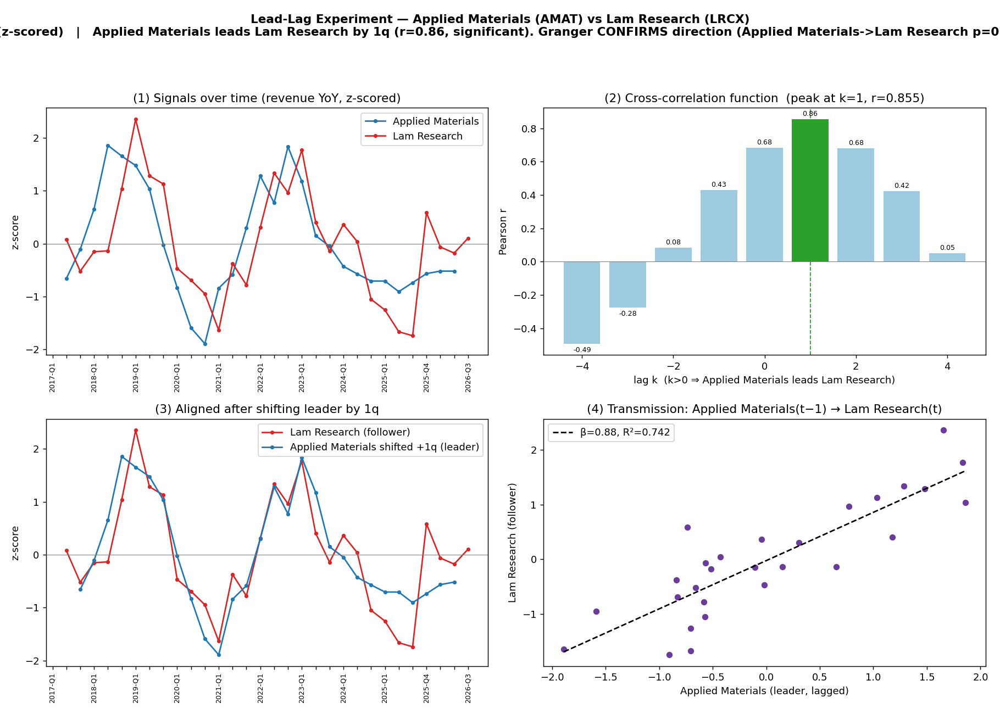

# Lead-Lag Experiment — Applied Materials (AMAT) vs Lam Research (LRCX)

**Signal:** revenue_usd_m (YoY, z-scored)  |  **Date:** 2026-07-02

| statistic | value |
|---|---|
| signal | revenue_usd_m |
| quarters available | 33 (AMAT) / 34 (LRCX) |
| contemporaneous corr (k=0) | 0.684 |
| best lag k* | 1  (Applied Materials leads Lam Research by 1 quarter(s)) |
| peak correlation r | 0.855  (p=0.0) |
| Granger AMAT→LRCX p | 0.0 |
| Granger LRCX→AMAT p | 0.1538 |
| transmission β | 0.88 |
| transmission R² | 0.742 |
| regression n | 28 |

**Verdict:** Applied Materials leads Lam Research by 1q (r=0.86, significant). Granger CONFIRMS direction (Applied Materials->Lam Research p=0.000 < reverse 0.154).

## Cross-correlation function

| lag k | corr | p-value | n |
|---|---|---|---|
| -4 | -0.493 | 0.012 | 25 |
| -3 | -0.276 | 0.173 | 26 |
| -2 | 0.085 | 0.675 | 27 |
| -1 | 0.429 | 0.023 | 28 |
| 0 | 0.684 | 0.000 | 29 |
| 1 | 0.855 | 0.000 | 29 |
| 2 | 0.679 | 0.000 | 28 |
| 3 | 0.423 | 0.028 | 27 |
| 4 | 0.051 | 0.803 | 26 |

