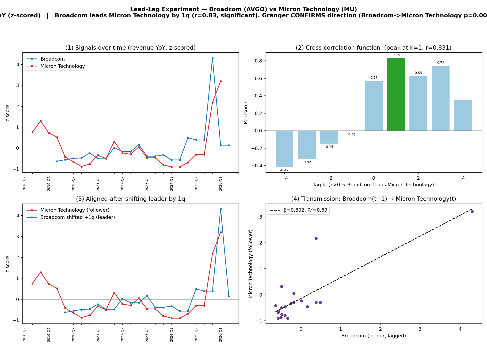

# Lead-Lag Experiment — Broadcom (AVGO) vs Micron Technology (MU)

**Signal:** stock_price (YoY, z-scored)  |  **Date:** 2026-07-02

| statistic | value |
|---|---|
| signal | stock_price |
| quarters available | 26 (AVGO) / 28 (MU) |
| contemporaneous corr (k=0) | 0.571 |
| best lag k* | 1  (Broadcom leads Micron Technology by 1 quarter(s)) |
| peak correlation r | 0.831  (p=0.0) |
| Granger AVGO→MU p | 0.0068 |
| Granger MU→AVGO p | 0.3372 |
| transmission β | 0.802 |
| transmission R² | 0.69 |
| regression n | 20 |

**Verdict:** Broadcom leads Micron Technology by 1q (r=0.83, significant). Granger CONFIRMS direction (Broadcom->Micron Technology p=0.007 < reverse 0.337).

## Cross-correlation function

| lag k | corr | p-value | n |
|---|---|---|---|
| -4 | -0.417 | 0.068 | 20 |
| -3 | -0.322 | 0.155 | 21 |
| -2 | -0.149 | 0.519 | 21 |
| -1 | -0.009 | 0.969 | 21 |
| 0 | 0.571 | 0.007 | 21 |
| 1 | 0.831 | 0.000 | 20 |
| 2 | 0.626 | 0.004 | 19 |
| 3 | 0.744 | 0.000 | 18 |
| 4 | 0.350 | 0.169 | 17 |

