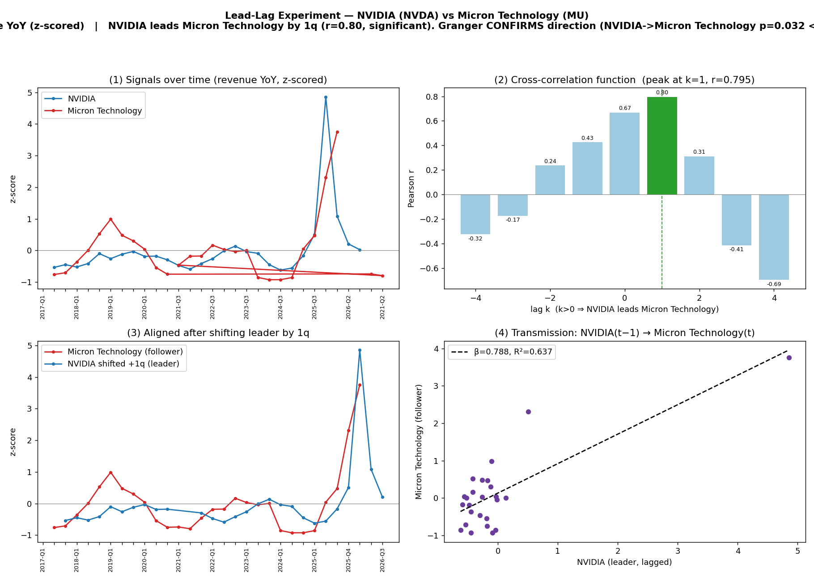

# Lead-Lag Experiment — NVIDIA (NVDA) vs Micron Technology (MU)

**Signal:** revenue (YoY, z-scored)  |  **Date:** 2026-07-02

| statistic | value |
|---|---|
| signal | revenue |
| quarters available | 32 (NVDA) / 32 (MU) |
| contemporaneous corr (k=0) | 0.669 |
| best lag k* | 1  (NVIDIA leads Micron Technology by 1 quarter(s)) |
| peak correlation r | 0.795  (p=0.0) |
| Granger NVDA→MU p | 0.0321 |
| Granger MU→NVDA p | 0.2659 |
| transmission β | 0.788 |
| transmission R² | 0.637 |
| regression n | 25 |

**Verdict:** NVIDIA leads Micron Technology by 1q (r=0.80, significant). Granger CONFIRMS direction (NVIDIA->Micron Technology p=0.032 < reverse 0.266).

## Cross-correlation function

| lag k | corr | p-value | n |
|---|---|---|---|
| -4 | -0.323 | 0.143 | 22 |
| -3 | -0.172 | 0.432 | 23 |
| -2 | 0.236 | 0.267 | 24 |
| -1 | 0.426 | 0.034 | 25 |
| 0 | 0.669 | 0.000 | 26 |
| 1 | 0.795 | 0.000 | 25 |
| 2 | 0.311 | 0.139 | 24 |
| 3 | -0.413 | 0.050 | 23 |
| 4 | -0.694 | 0.000 | 22 |

