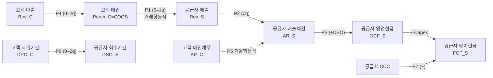

# 회계지표 기업간 Lead-Lag — 도출·수식·도식 (산출물 a)

**분석일:** 2026-07-09 · **데이터:** `panel_long.csv` · **이론:** `accounting_flow_theory.md`

복식부기 항등식에서 연역한 가설 P1–P7을 데이터로 검증. 예측 시차/부호(회계 근거)와 실측(support_rate=부호일치·유의 비율)을 대조.

## 1. 회계 흐름 도식

## 2. 가설 검증 결과

| # | 유형 | 관계 | 회계 근거 | 예측시차 | 예측부호 | 실측 지지율 | 유의/검정 | 실측 평균시차 | 평균 r |
|---|---|---|---|---|---|---|---|---|---|
| **P1** | 기업간 | 고객 매입(COGS) → 공급사 매출 | 거래 항등식 Rev_S=Σω·Purch_C (정의1) | 0–1 | + | **1.0** | 51/69 | 2.43 | 0.652 |
| **P2** | 기업내 | 매출 → 매출채권 | AR 동학 (정의4) | 0 | + | **0.87** | 13/15 | 0.0 | 0.791 |
| **P3** | 기업내 | 매출 → 영업현금흐름 | OCF=NI+D&A−ΔNWC (정의5) | +DSO | + | — (데이터부족) | 0/0 | nan | nan |
| **P4** | 기업간 | 고객 매출 → 공급사 매출 | 수요→매입→매출 전파 | 0–2 | + | **1.0** | 96/137 | 2.26 | 0.625 |
| **P5** | 기업간 | 고객 매입채무 → 공급사 매출채권 | 거울 항등식 AP_C=AR_S (정의2) | 0–1 | + | **1.0** | 86/123 | 1.92 | 0.65 |
| **P6** | 기업간 | 고객 지급기간 → 공급사 회수기간 | 현금전이 DPO_C→DSO_S (§3) | 0–2 | + | **0.846** | 35/70 | 1.36 | 0.533 |
| **P7** | 기업내 | 현금전환주기 → FCF마진 | CCC·현금전환 (정의3,5) | 0–1 | - | **0.5** | 2/4 | 0.5 | 0.668 |

## 3. 핵심 수식 (이론 문서 §요약)

**거래 항등식 (P1):**  $\text{Rev}_{S,t}=\sum_{C\to S}\omega_{C\to S}\,\text{Purch}_{C,t}$, $\ \text{Purch}_C=\text{COGS}_C+\Delta\text{Inv}_C$

**거울 항등식 (P5):**  $\text{AP}^{(C\to S)}_{C,t}=\text{AR}^{(C\to S)}_{S,t}$

**운전자본 사이클:**  $\text{CCC}=\text{DIO}+\text{DSO}-\text{DPO}$

**현금흐름 항등식 (P3,P7):**  $\text{OCF}=\text{NI}+\text{D\&A}-\Delta\text{NWC}$, $\ \Delta\text{NWC}=\Delta\text{Inv}+\Delta\text{AR}-\Delta\text{AP}$, $\ \text{FCF}=\text{OCF}-\text{Capex}$

**공적분 제약 (→ VECM):**  $\log\text{Rev}_{S,t}=c_S+\sum_C\theta_{S,C}\log\text{Rev}_{C,t}+u_{S,t}$, $\ \Delta\log\text{Rev}_{S,t}=\alpha_S u_{S,t-1}+\sum_C\beta_{S,C}\Delta\log\text{Rev}_{C,t}+\eta$

## 4. 해석
- support_rate = 예측 부호와 일치하며 유의한 관계 비율. 1.0에 가까울수록 회계 이론이 데이터로 뒷받침됨.
- 기업간(P1,P4,P5)은 기업쌍, 기업내(P2,P3,P7)는 동일기업 검정.
- 상세 기업쌍/변환은 `universal_channels.csv`, `cashflow_channels_data.csv` 참조.

## 5. 한계
- 거래처별 분해(ω) 부재 → 집계 근사. 표본 ~40분기. 상관≠거래(10-K 교차확인).
